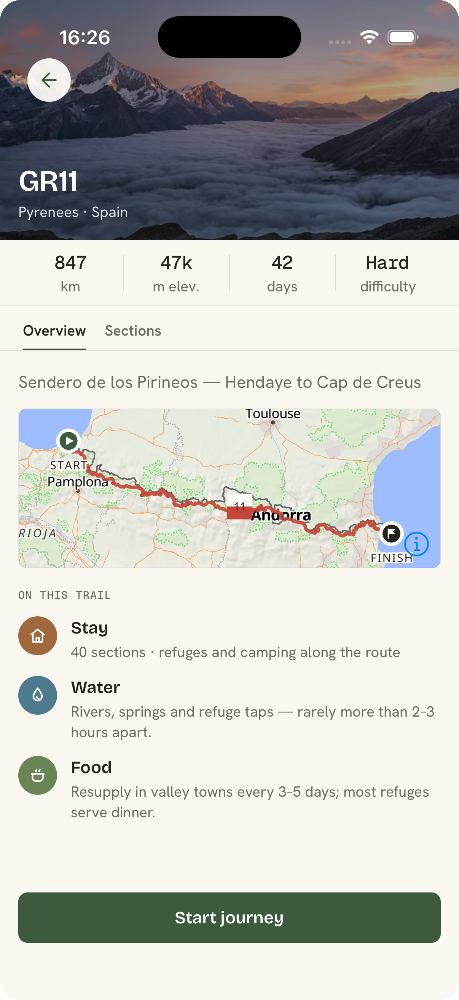
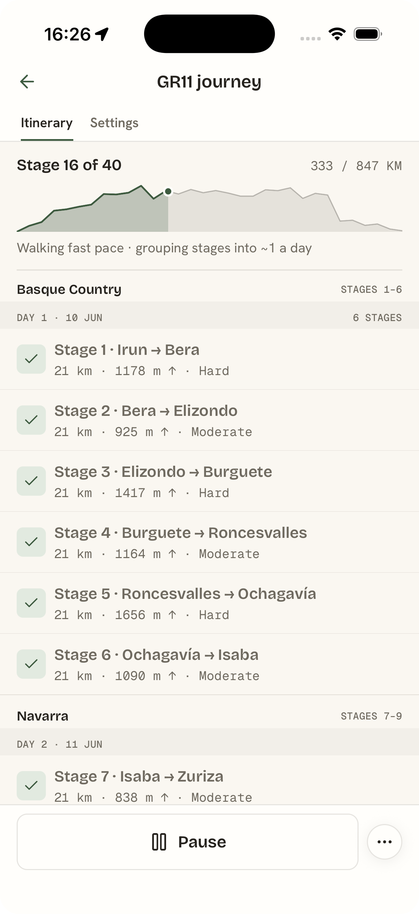
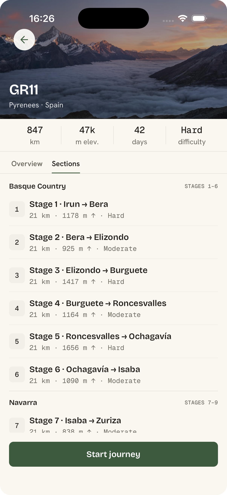
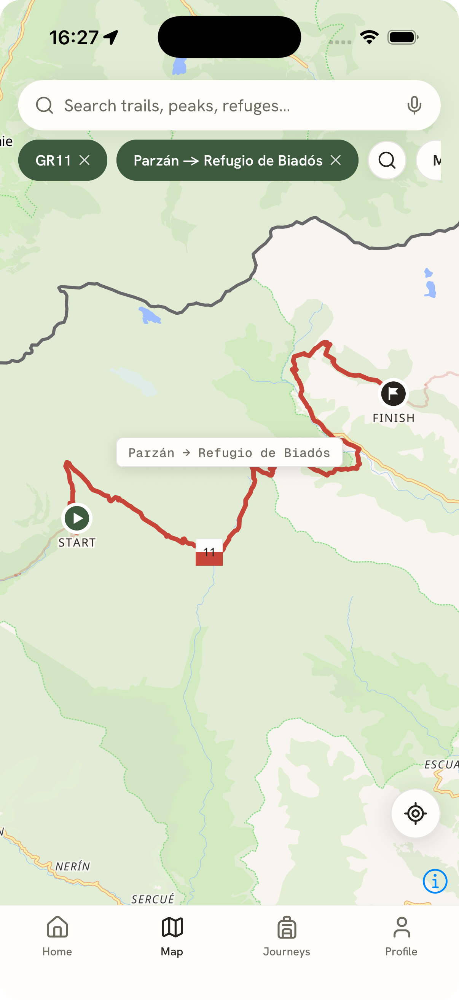
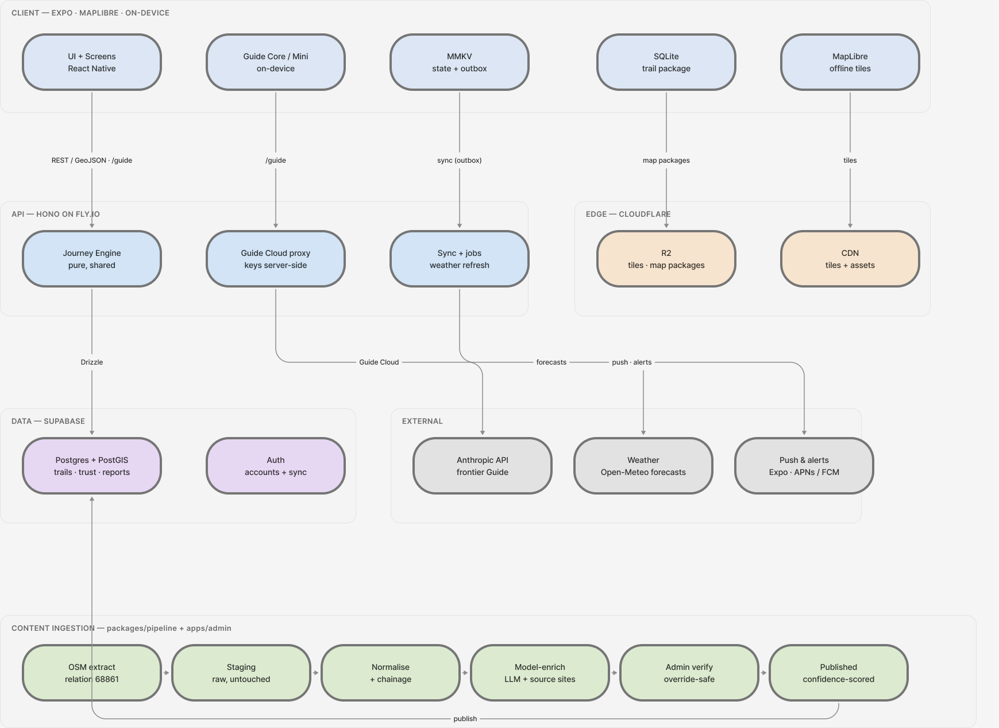
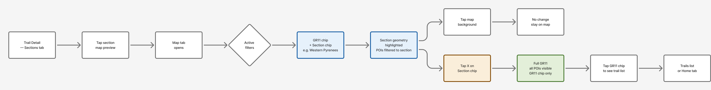

<div align="center">


### A long-distance trail companion for the days you spend off-grid

Plan a journey on a long trail, navigate it stage-by-stage with offline maps,
and ask an on-trail **Guide** the things that actually matter — *where's the next water,
will I reach the refuge before dark?*

> [!NOTE]
> **Roam is in active development.** It's being built one trail end-to-end (the GR11)
> before going wide. Expect rough edges and moving parts.

</div>

---

## What it is

Roam turns a long-distance route into a personal, **offline-first** journey. Two objective
types share one engine: **multi-day trails** (the GR11) and **peaks** (Aneto, with several
lines up). You pick a route, set direction, pace and an accommodation style, and Roam groups
the trail's curated stages (*etapas*) into days and suggests overnight stops.

On trail, a full-screen map shows the route, your position, and nearby water and refuges. The
**Guide** answers questions from the downloaded trail package — no signal required.

Progress is counted in **stages, not days**. You complete a stage when you reach its end; pace
is a soft grouping hint that re-groups freely, never a contract. Pausing is a non-event.

<div align="center">

| Plan the journey | Walk it, stage by stage |
|:---:|:---:|
|  |  |
| **Trail overview** — distance, elevation, what's on the trail | **Itinerary** — region bands, day groups, elevation progress |
|  |  |
| **Stages** — the curated *etapas*, the progress spine | **On trail** — route, blaze, start/finish, your position |

</div>

---

## How it's built

A self-hosted, offline-first stack: OpenStreetMap into PostGIS, served as GeoJSON and
self-hosted vector tiles, rendered with MapLibre. No third-party map token, no per-user
metering — the worst case (download an 800 km corridor and use it for weeks off-grid) is the
design centre, not an edge case.

<div align="center">

</div>

The same domain code runs on the server and on the device, so planning is identical online and
offline. The **Journey Engine** (`packages/core`) is pure and dependency-light — it groups
curated stages into days and answers the Guide's questions over linearly-referenced trail data.

The trail dataset itself is the product's primary asset, built by a **config-driven ingestion
pipeline** rather than by hand: OSM extract → normalise + chainage → model-enrich → human verify
→ publish, with every fact carrying provenance, freshness and a derived confidence. Hikers at the
spring become the curators — one-tap reports keep water and refuge data live.

<div align="center">

<br/><em>One flow through the app: from a trail's stages to a focused section on the map.</em>
</div>

---

## Stack

| Layer | Choice |
|---|---|
| **Mobile** | Expo (React Native) · MapLibre · Zustand · TanStack Query · MMKV · SQLite (`op-sqlite`) |
| **API** | Bun · Hono · Drizzle ORM · deployed on Fly.io |
| **Data** | PostgreSQL + PostGIS on Supabase (also Auth + storage) |
| **Tiles & assets** | OSM → Martin/PMTiles → z/x/y MVT · Cloudflare R2 + CDN |
| **Guide** | Deterministic Guide Core (offline) → Guide Cloud (Anthropic, online) → optional on-device Guide Mini |

The map SDK is a native module, so the app runs on a **custom Expo dev client / EAS build** —
not Expo Go.

---

## Repository layout

```
roam/
├── apps/
│   ├── mobile/      # Expo app — UI, map, offline store, Guide client
│   ├── api/         # Hono + Bun service — REST / GeoJSON, Guide Cloud proxy
│   └── admin/       # internal curation tool — review content & crowd reports
└── packages/
    ├── core/        # pure domain: types, Journey Engine, Guide tools (no I/O)
    ├── db/          # Drizzle schema + migrations + seed
    ├── pipeline/    # content ingestion: OSM extract → normalise → model-enrich
    └── config/      # shared tsconfig, eslint/biome, per-trail ingestion configs
```

---

## Getting started

Requires [Bun](https://bun.com), a custom Expo dev client (iOS Simulator or a device — not Expo
Go), and a Postgres + PostGIS database.

```bash
bun install                    # install the workspace

bun run --filter @roam/db db:migrate   # set up the schema
bun run --filter @roam/db db:seed      # seed the GR11 dataset

bun run dev:api                # Hono API (watch mode)
bun run dev:mobile             # Expo dev server
```

Project-wide checks:

```bash
bun run typecheck              # tsc across every workspace
bun test                       # unit tests (engine, guide tools, pipeline)
bun run lint                   # biome
```

---

</content>
